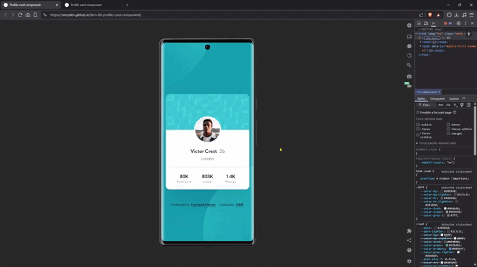

# 🚀 Frontend Mentor - Profile card component solution

This is a solution to the [Profile card component challenge on Frontend Mentor](https://www.frontendmentor.io/challenges/profile-card-component-cfArpWshJ).  
The goal was to build a responsive profile card from a provided design.
Beyond matching the layout, I focused on accessibility, semantic structure, and clean CSS architecture.

---

## 🎬 Demo



---

## 🎯 The challenge

- Build out the project to the designs provided

## 📸 Screenshots

### 📱 Mobile


### 📱 Tablet


### 🖥️ Desktop


### 🖥️ Desktop - Interaction states (Hover & Focus-Visible)


---

## 🔗 Links

- 🌎 [Live site](https://vimpdev.github.io/fem-06-profile-card-component/)
<!-- - 👩‍💻 [Frontend Mentor solution](https://your-solution-url.com) -->

---

## 🛠️ Built with

- Semantic HTML5
- Mobile-first workflow
- CSS custom properties
- CSS Nesting
- Flexbox
- CSS Grid
- Accessible interaction states (`:focus-visible`)
- Open Graph & Twitter meta tags

---

## 🧠 Key Implementation Decisions

### 1️⃣ Layout Architecture

The page uses a flex-based vertical structure:
```css
.page {
  min-block-size: 100dvh;
  display: flex;
  flex-direction: column;
}
```
The card itself is centered without using positioning hacks, and the avatar overlaps the cover using:
```css
.profile-card__avatar {
  position: absolute;
  top: 8.75rem;
  left: 50%;
  transform: translate(-50%, -50%);
}
```
This keeps the layout structurally coherent and avoids magic numbers tied to visual compensation.

### 2️⃣ Background Composition

The circular background patterns were implemented using layered `background` values and responsive viewport units:
```css
background:
  url(...) no-repeat left -95vw top -45vh / 150vw,
  url(...) no-repeat right -95vw bottom -30vh / 150vw,
  var(--blue-600);
```
At larger breakpoints, the background size and positioning are adjusted to maintain visual balance.

This was one of the most interesting parts of the challenge.

### 3️⃣ CSS Nesting

I used modern CSS nesting with direct child combinators (`>`) for clearer structure:
```css
.profile-card__body {
  > p {
    margin-top: 0.5rem;
  }
}
```
#### 📖 Resource used:

+ [Nesting](https://web.dev/learn/css/nesting?hl=es-419) by [web.dev](https://web.dev/)

### 4️⃣ Accessibility

- `:focus-visible` states for interactive links
- Proper heading hierarchy
- Semantic grouping
- Meaningful `alt` attributes
- Open Graph and Twitter `og:image:alt` metadata

The desktop interaction preview intentionally shows hover and focus-visible states.

### 5️⃣ SEO & Social Metadata

Added:

- Optimized `<title>`
- Meta description
- Open Graph tags
- Twitter Card tags
- `og:image:alt` and `twitter:image:alt`

This ensures the project previews correctly when shared on LinkedIn, Twitter, or Discord.

#### 📖 Resource used:

- [OG - OpenGraph](https://www.opengraph.xyz/)

---

## 📈 What I learned

- How to position layered background SVGs using viewport units instead of fixed pixel offsets
- The difference between visual compensation and structural alignment
- How to use CSS nesting in a clean and readable way
- The importance of consistent branding across projects

---

## 🤖 AI Collaboration

AI was used as a reasoning and review assistant during this project. It supported:

- Layout and positioning analysis  
- Background composition refinement  
- Structural CSS decisions  
- Commit naming consistency  
- README clarity and metadata improvements  

All implementation decisions were manually evaluated, adapted, and coded as part of my learning process.

---

## 👤 Author

- Frontend Mentor - [@vimpdev](https://www.frontendmentor.io/profile/vimpdev)

---

## 🙌 Acknowledgments

Thanks to Frontend Mentor for providing structured design challenges that help simulate real-world UI implementation.